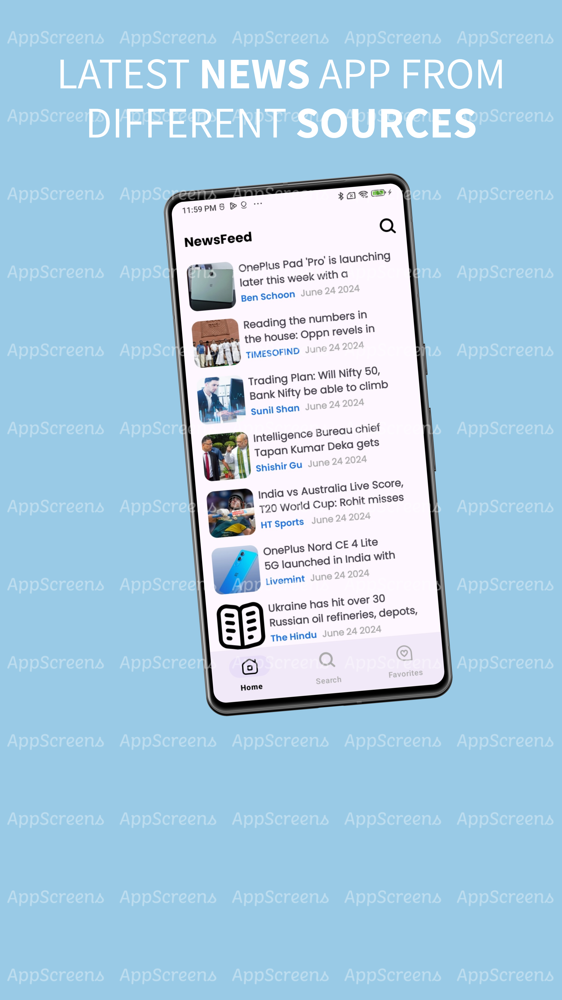
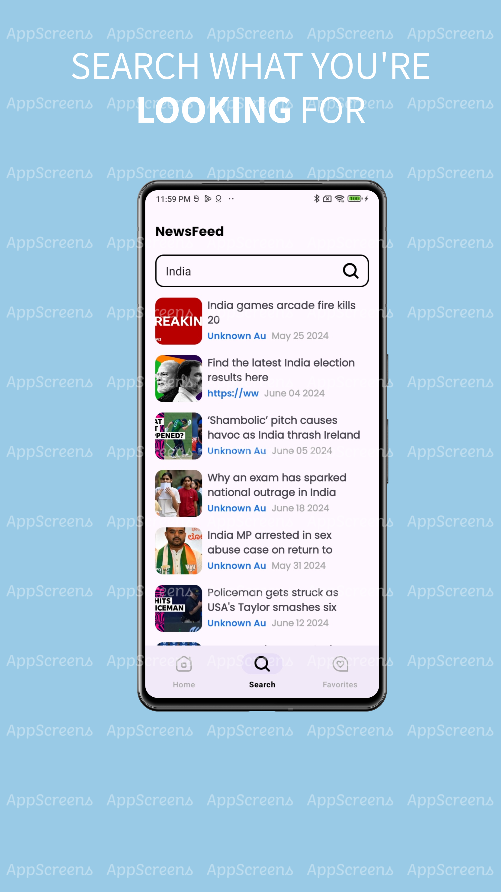
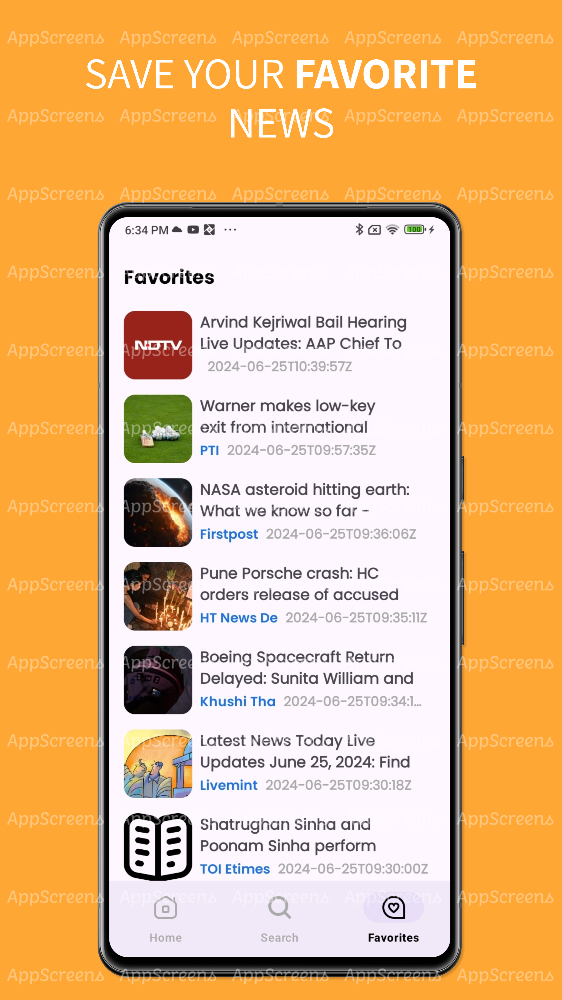
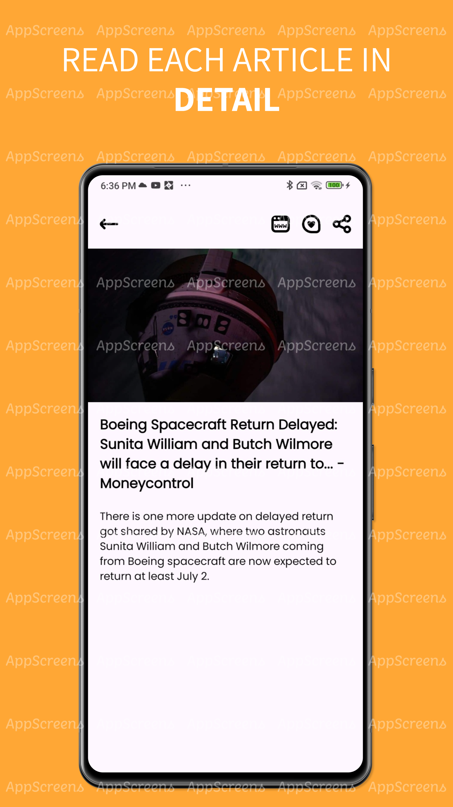

# Clean News App

Clean News App is an Android application built using the Clean Architecture with MVVM (Model-View-ViewModel) pattern. The app fetches news articles from a remote API and displays them in a user-friendly manner. Users can navigate through Home, Search, and Favorite tabs and view details of individual news articles.

## Screenshots

<p align="center">
  
  
  
  
</p>

## Features

- Display news articles in a list format.
- Search for news articles.
- Mark news articles as favorites.
- View detailed information about a news article.
- Offline support with Room database.

## Architecture

The application follows a single module clean architecture with MVVM pattern. It ensures separation of concerns, making the codebase more maintainable and testable.

### Layers

1. **Presentation Layer**: Contains UI-related classes like Activities, Fragments, and ViewModels.
2. **Domain Layer**: Contains use cases which encapsulate business logic.
3. **Data Layer**: Handles data operations and includes repositories, data sources, and Room database.

### Folder Structure

```plaintext
clean-news-app/
├── app/
│   ├── src/
│   │   ├── main/
│   │   │   ├── java/
│   │   │   │   ├── me/
│   │   │   │   │   ├── prashant/
│   │   │   │   │   │   ├── cleannews/
│   │   │   │   │   │   │   ├── presentation/
│   │   │   │   │   │   │   │   ├── ui/
│   │   │   │   │   │   │   │   │   ├── newslisting/
│   │   │   │   │   │   │   │   │   │   ├── NewsListingFragment.kt
│   │   │   │   │   │   │   │   │   ├── newsdetail/
│   │   │   │   │   │   │   │   │   │   ├── NewsDetailFragment.kt
│   │   │   │   │   │   │   │   │   ├── search/
│   │   │   │   │   │   │   │   │   │   ├── SearchNewsListingFragment.kt
│   │   │   │   │   │   │   │   │   ├── favorite/
│   │   │   │   │   │   │   │   │   │   ├── FavoriteNewsListingFragment.kt
│   │   │   │   │   │   │   │   ├── model/
│   │   │   │   │   │   │   │   │   ├── ArticleUiModel.kt
│   │   │   │   │   │   │   │   ├── viewmodel/
│   │   │   │   │   │   │   │   │   ├── NewsViewModel.kt
│   │   │   │   │   │   │   ├── domain/
│   │   │   │   │   │   │   │   ├── usecase/
│   │   │   │   │   │   │   │   │   ├── GetNewsUseCase.kt
│   │   │   │   │   │   │   │   │   ├── SearchNewsUseCase.kt
│   │   │   │   │   │   │   ├── data/
│   │   │   │   │   │   │   │   ├── repository/
│   │   │   │   │   │   │   │   │   ├── NewsRepository.kt
│   │   │   │   │   │   │   │   ├── source/
│   │   │   │   │   │   │   │   │   ├── local/
│   │   │   │   │   │   │   │   │   │   ├── NewsDao.kt
│   │   │   │   │   │   │   │   │   │   ├── NewsDatabase.kt
│   │   │   │   │   │   │   │   │   ├── remote/
│   │   │   │   │   │   │   │   │   │   ├── NewsApi.kt
│   │   │   │   │   │   │   ├── di/
│   │   │   │   │   │   │   │   ├── AppModule.kt
│   │   │   │   ├── res/
│   │   │   │   │   ├── layout/
│   │   │   │   │   │   ├── fragment_home_news_listing.xml
│   │   │   │   │   │   ├── fragment_search_news_listing.xml
│   │   │   │   │   │   ├── fragment_favorite_news_listing.xml
│   │   │   │   │   │   ├── fragment_news_detail.xml
│   │   │   │   │   ├── navigation/
│   │   │   │   │   │   ├── nav_graph.xml
│   │   │   │   │   ├── values/
│   │   │   │   │   │   ├── strings.xml
│   ├── build.gradle
├── build.gradle
├── README.md
└── ...
```
**Tech Stack**

**Kotlin**: Programming language.
**MVVM**: Architecture pattern.
**Hilt**: Dependency Injection.
**Navigation Component**: For handling navigation.
**Room**: For offline data storage.
**Retrofit**: For network requests.
**Coroutines**: For asynchronous operations.
**Glide**: For image loading.

**License**
This project is licensed under the MIT License - see the LICENSE file for details.
